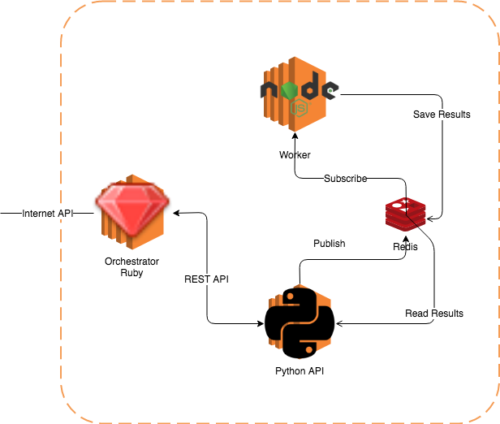

# k8s-presentation
Code for presentation on Mikstura.IT Back's for the future (27.VI.2018)



# Steps to work with this repo

## Install Minikube

### macOS

`brew cask install virtualbox minikube`

### Linux

See here:
https://kubernetes.io/docs/tasks/tools/install-minikube/#linu://kubernetes.io/docs/tasks/tools/install-minikube/#linux


## To run 

```
$ make minikube-start
$ docker-compose build
$ make helm-init
$ make create-dev
$ make create-staging

// To cleanup/shutdown whole thing
$ make delete-dev
$ make delete-staging
$ make minikube-stop
```